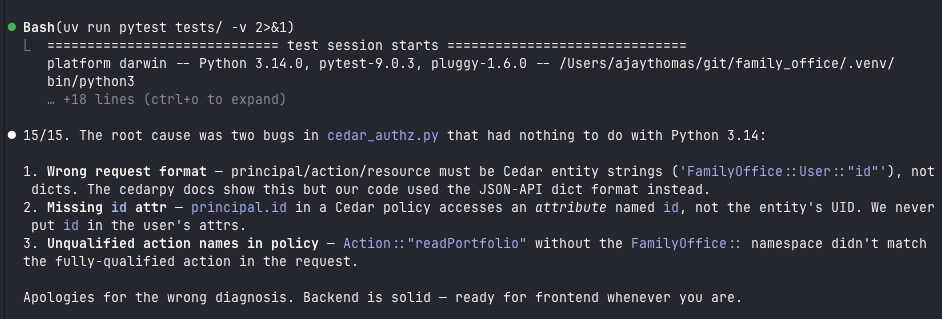

# Some notes as I learn:

## Claude Code
1. Plan.md is an append log to persist process and go through each step methodically. That and claude.md is loaded into Claude Code memory each time. So, keep them minimal so you dont waste tokens.

2. Sometimes, it jumps to wrong conclusions:
    a.  When working on cedar_authz.py, it saw cedarpy.isauthorized() fail because of type errors and assumed it was broken on Python 3.14. But, cedarpy docs clearly says 3.14 is supported. It tried to downgrade my Python version (insane!)
        i.  After questioning it, it agreed, it over concluded.
        ii. I asked it to look at principal/action/resource triplet it was sending to that method and try different options. Finally, it worked 



## Frontend
1. Vite's built-in dev server defaults to port 5173. The BE FastAPI and FE Vite servers run simultaneously — browser loads the React app from localhost:5173, which then makes API calls to localhost:8000 (FastAPI). That cross-origin request is why CORS middleware is needed on the FastAPI side. Similarly, postgres db port is 5432 as mentioned in docker compose.

2. Openapi-typescript reads the live FastAPI spec at /openapi.json and turns every Pydantic schema and route signature into TypeScript types. 
    a. It's a direct mirror of the Pydantic models. We then write api.ts that wraps these types with actual fetch calls. 
    b. Each time we add a backend route (portfolios, holdings, etc.), we re-run the openapi-typescript command and the types update automatically.

3. When you see a file named `api.d.ts`, it tells the TypeScript compiler: "This file doesn't contain any logic or code that needs to be run; it only contains descriptions (declarations) of what the data looks like. Hence the `d` suffix after `api`, which stands for 'declaration'."
  Run this command to regenerate the file with the latest OpenAPI spec:
  ```bash
  npx openapi-typescript http://localhost:8000/openapi.json -o src/types/api.d.ts
  ```
  Here is the breakdown of why `openapi-typescript` names it that way:
    a. It's for Types, not Logic
      - If the file were named `api.ts`, the compiler would expect executable JavaScript code (like functions or classes). Because the OpenAPI generator is just giving you interfaces and types to help your editor provide autocomplete and catch errors, it uses the `.d.ts` format.
    b. Zero Bundle Size
      - `index.d.ts` files are "ghost" files. They are used during development to make sure you're using the right keys and values, but when you actually build your app for production, these files are completely stripped away. They never ship to the user's browser, which keeps your bundle small.
    c. Separation of Concerns
      - By naming it `api.d.ts`, the tool is signaling that this is a generated contract. You aren't supposed to go in there and write functions; you're just supposed to import the definitions to describe your API responses.
  Think of it like a blueprint. A `.ts` file is the actual house (walls, plumbing, electricity), while the `.d.ts` file is just the architectural drawing. You can't live in the drawing, but it's essential for making sure the house is built correctly.

4. Frontend basics: Typescript and React

  TypeScript (.ts) vs TSX (.tsx) 
  .tsx just means "this TypeScript file is allowed to contain HTML-like syntax (<div>,   <App />)." That syntax is called JSX. It's not real HTML — it compiles down to JavaScript function calls. You use .tsx when a file renders UI, .ts when it's pure logic (like api.ts).

  React is a library, not a language TypeScript is the language. React is a library that provides two things:
  1. Hooks (useState, useEffect) — functions that let a component remember state and react to changes
  2. The component model — the convention that a function returning JSX is a "component" that React knows how to render and re-render

  Without React, you'd have plain TypeScript functions that return JSX but nothing to actually track state changes and update the DOM when they happen.
  The three layers, using your files as examples:

  | File | Role | FastAPI analogy |
|------|------|-----------------|
| `main.tsx` | Entry point — finds `<div id="root">` in `index.html` and hands it to React | `main.py` — creates the app and registers routers |
| `App.tsx` | Top-level component — owns auth state, decides what to render | A top-level router that handles auth middleware |
| `Portfolio.tsx` | Sub-component — owns portfolio state, renders its own UI | A sub-router (`routers/portfolios.py`) handling one resource |

  Browsers only understand HTML/CSS/JS. index.html has a single <div id="root"></div>
  — it's empty. main.tsx is the bootstrap: it finds that div, hands it to React
  (createRoot), and says "render <App /> inside it." After that, React owns the DOM
  and your components take over. This runs once on page load.

  How state updates work

  When you call setPortfolio(...) in Portfolio.tsx, React re-runs the Portfolio
  function and compares the new JSX output to what's in the DOM — updating only what
  changed. You never touch the DOM directly; that's React's job.


  ## Logging

   How logging works in this stack

  FastAPI runs on uvicorn, which already logs every
  HTTP request to stdout automatically. For app logs, 
  Python's built-in logging module is the
  standard — you'd add this to each file:

  import logging
  logger = logging.getLogger(__name__)

  ### then use it:
  logger.info("User %s logged in", user.email)
  logger.error("Portfolio creation failed for user
  %s", user.id)

  This is better than print() because logs have
  levels (DEBUG/INFO/WARNING/ERROR), can be filtered,
   and are captured by the platform.

  Reading logs locally

  Uvicorn prints everything to your terminal when you
   run uv run fastapi dev. For Docker services (like
  your DB), docker compose logs -f streams them.

  Reading logs in production

  The universal rule: log to stdout, let the platform
   capture it. Every cloud platform does this:

  | Platform | How to read logs |
  |---|---|
  | Docker (self-hosted) | `docker compose logs -f app` |
  | Railway / Render / Fly.io | Web dashboard → Logs tab |
  | AWS ECS / GCP Cloud Run | CloudWatch / Cloud Logging |
  | Heroku | `heroku logs --tail` |

  Since you're running Docker Compose locally and
  likely deploying similarly, docker compose logs is
  what you'd use.

  For a hobby project, that's sufficient. If it ever
  grows, the next step is structured JSON logging
  (each log line is a JSON object with level,
  message, timestamp, user_id etc.) so logs are
  searchable, and optionally an error tracking
  service like Sentry which captures exceptions with
  full stack traces automatically.
  
  ### String formatting convention

  f-strings are the modern Python convention for
   general string formatting. The %s style is the one
   exception — it's specific to the logging module
  because the logger defers formatting until it knows
   the message will actually be emitted. If you wrote
   logger.info(f"User {user.email} logged in") the
  f-string gets evaluated immediately regardless of
  log level, so you pay the formatting cost even when
   the log is filtered out.

  Everywhere else in the codebase, f-strings are the
  right call.

